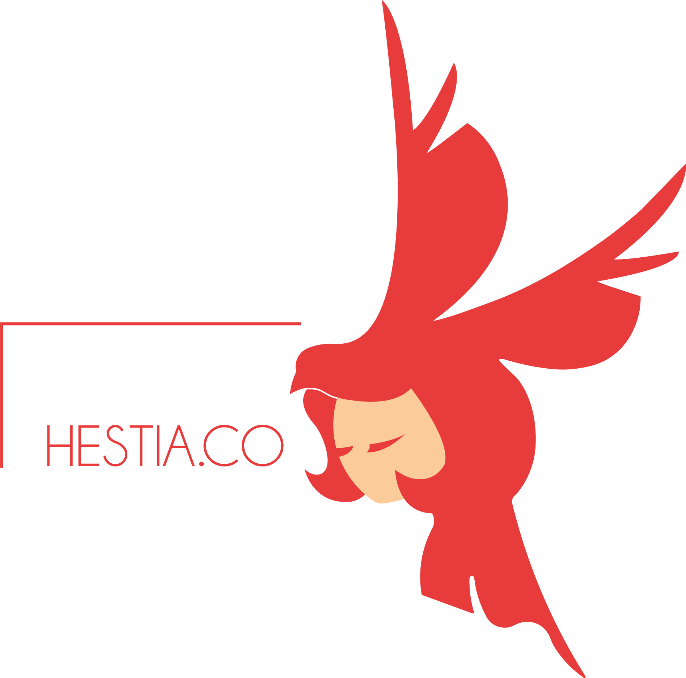

# Meet mode
Site vitrine promouvant l'événement Meet Mode.
## Table of Contents
1. [Pour commencer](#Pour-commencer)
2. [Pré-requis](#Pré-requis)
3. [Installation](#installation)
4. [Technologies](#technologies)
5. [Auteurs](#Auteurs)
6. [Licence](#Licence)

### Pour commencer
*** Il s'agit d'un projet fictif dans le cadre du projet tuteuré de l'IUT de Lens.
C'est un site vitrine ayant pour but d'aider à promouvoir le salon Meet Mode.
Il contient 10 pages:
* Page d'accueil
* Exposants
* Info pratique
* Presse
* Ressources
* Mention légal
* Contact
Ainsi qu'une suite de 3 pages liées à une newsletter.


### Pré-requis
Afin de pouvoir exploiter le projet, il vous est requis d'installer au préalable :
* Un éditeur de texte (ex:VS Code, Atom etc..)
* Utilisation de Wamp est fortement recommandé en qualité d':
environnement comprenant trois serveurs (Apache, MySQL et MariaDB), interpréteur de script (PHP), ainsi que phpMyAdmin pour l'administration Web des bases MySQL.
* Un terminal de commande (git)
* Les versions 7.3(.21) et supérieure de PHP sont nécessaires pour le bon fonctionnement du site.
## Installation
***
Afin d'installer le projet vous devez d'abord l'importer sur vos machines.
Pour se faire, suivez cette commande.
```
$ git clone https://github.com/HestiaCommunication/PTut.git
```
Une fois fait, il vous faut installer la base de données:
Pour se faire ouvrir wamp, puis dans un navigateur tapez http://localhost/ afin d'accéder à la page d'accueil de wamp, dans l'onglet outils vous trouverez phpmyadmin, qui vous permettra de créer et gérer la base de données.
Appuyer sur nouvelle base de données saisissez comme nom :"newsletter".
Une fois créée vous pouvez utiliser l'onglet importé afin d'importer le dossier newsletter.sql qui déploiera la base déjà faite.
Ce document se trouve à la racine du dossier newsletter.

Enfin, afin de pouvoir voir le site en local sur votre machine, il vous faut taper la commande suivante dans un terminal :
```
php -S localhost:8000

```
Vous pouvez désormais voir le site en tapant localhost:8000 dans votre navigateur.
## Technologies
***
Technologies utilisées pendant le projet:
* Visual Studia Code:
* HTML5:
* CSS:
* PHP:version 7.3.21 et supérieure.
* JavaScript:
* Bootstrap 4]:
* Figma:
* Git:


## Auteurs
*** Projet réalisé par:
* Hodé Florent
* Leemann Rémi
* Soltysiak Clement

***Développeur pour l'agence Hestia.co 

##Licence
Copyright © 2021, Hestia.co. Released under the MIT License.

